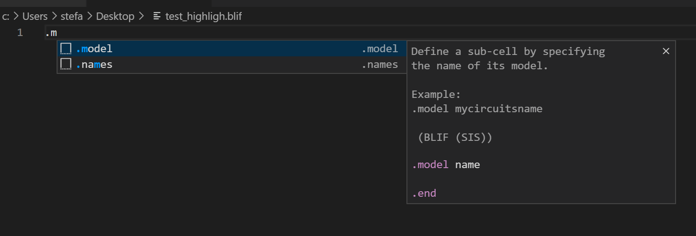
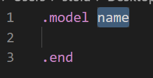
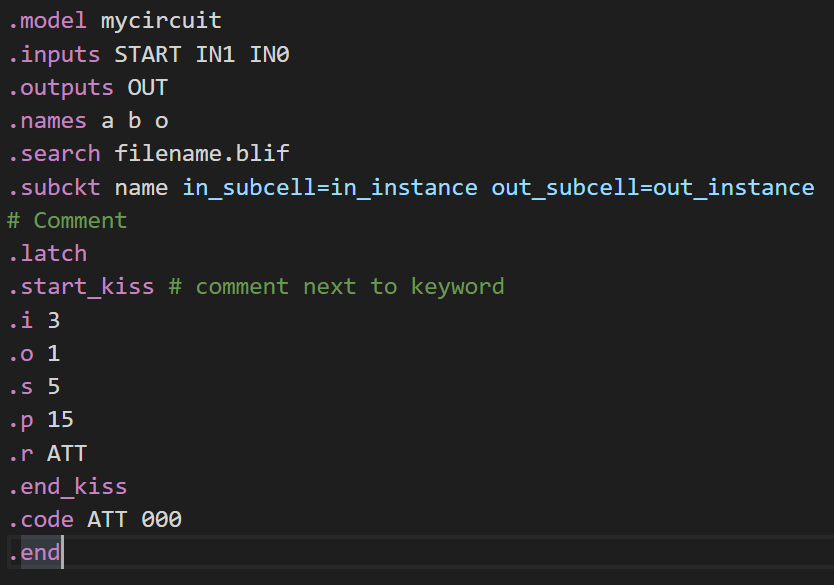

# VSCODE-BLIF

This is the README for the **BLIF extension** (vscode-blif) for Visual Studio Code.
> BLIF is SIS' Berkeley Logic Interchange Format.
> 
> SIS is a tool that optimizes and simulates logic gate and finite state machine networks


This extension allows you to:
* Start to develop a .blif file from a **template**
    > Currently the included templates are: 
    > * ```!fsm```, which is a Finite State Machine template
    > * ```!lgate```, which is a Logic Gate template

* **Autocomplete keywords** (commands that start with the dot ```.```)

* **See what a keyword does** while using the autocomplete feature

* **Syntax highlight** keywords

<br>

> Disclaimer: 
>
> I'm **not** affiliated with the SIS and the Visual Studio Code developers in any way.
>
> The aim of the extension is only to add syntax highlighting and autocompletion for the BLIF format, 
> SIS' Berkeley Logic Interchange Format, on VS Code.

## README Index
* [Installation](#installation)
* [Features](#features)
    * [Templates](#templates)
    * [Keyword autocompletion](#keyword-autocompletion)
    * [Keyword description](#keyword-description)
    * [Syntax highlighting](#syntax-highlighting)
* [Development](#development)
* [Release Notes](#release-notes)

## Installation
* **(BEST) First option**: to start using this extension with Visual Studio Code copy it into the extensions folder:

    * Windows: ```%USERPROFILE%\.vscode\extensions```
    * macOS: ```~/.vscode/extensions```
    * Linux: ```~/.vscode/extensions```

    and restart Code.
* **Second option**: download this repository, navigate to this directory via the terminal and execute the following command:

        npm install && npm run install
    > NPM is required to install the extension using this option

* (CURRENTLY NOT AVAILABLE) Third option: the VSIX package could be pushed to a github release.

    The VSIX package can then be installed from VS Code:
    * go to the Extension marketplace
    * click on the three dots ```...``` (position on top of the seach bar)
    * then click on ```Install from VSIX...```, select the VSIX file and click ```open```

    The VSIX package can also be installed from the terminal using the following command:

        code --install-extension <file>.vsix

* (CURRENTLY NOT AVAILABLE) Fourth option: when/If this extension will be published on the Visual Studio Code extension marketstore, 
you will be able to install it via the extension marketstore (from browser or from VS Code) 
    > Docs about extension publishing: https://code.visualstudio.com/docs
    
## Features

### Templates
Templates allow you to develop your .blif file from a basic, common, baseline.

Currently the included templates are: 
* ```!fsm```, which is a Finite State Machine template

    

* ```!lgate```, which is a Logic Gate template

    

### Keyword autocompletion
Keyword autocompletion allows you to **write keywords efficiently by completing a keyword** using the tab key:
* Start writing a keyword, like ```.m```

    

* The extension suggests you all the possible options for autocompletion,
use the arrow keys to hover over an option

* You can read what the keyword does on the right of the hovered option.
Select the option by clicking the tab key.

    

* If default values follow the keyword, start typing to replace the value and then use the tab key to move to the next default value (if available). 

    You can repeat this operation (tab key and then overwriting values)
    for every default value.

    > If you close the autocompletion you can also modify the values by modifing them normally

### Keyword description
Each keyword has a description that **is shown while using the autocompletion** feature.

These are the keywords that have a description:
* ```.model```: Define a sub-cell by specifying the name of its model
* ```.inputs```: Define the name of the input(s)
* ```.outputs```: Define the name of the output(s)
* ```.names```: Define a link between inputs and an output 
    (on a new line write a truth table with only minterms).
* ```.exdc```: Specifies that the following truth tables have don't care(s) as an output
* ```.start_kiss```: Defines a FSM.
* ```.end_kiss```: Closes the definition of an FSM.
* ```.i```: Specifies the number of inputs of a FSM.
* ```.o```: Specifies the number of outputs of a FSM.
* ```.s```: Specifies the number of states of a FSM
* ```.p```: Specifies the number of states transitions of a FSM
* ```.r```: Specifies the name of the reset state of a FSM
* ```.code```: Define a state encoding
* ```.subckt```: Initialize an instance of a sub-cell model.
* ```.search```: Searches (imports) sub-cell models defined in another .blif file.
* ```.latch```: Defines a latch.
* ```.end```: Closes the definition of a sub-cell model.

### Syntax highlighting
This extension **highlights keywords** that start with the dot ```.``` and ```.subckt``` parameters.

Highlighted keywords:



## Development
* Open this repository with visual studio code and then press `F5`
to open a new window with the extension loaded.
* You can relaunch the extension from the debug toolbar after making changes to the extensions files.
* You can also reload (`Ctrl+R` or `Cmd+R` on Mac) the VS Code window with the extension to load your changes.

## Release Notes

### 1.0.0

Initial release

## Author
[Zenaro Stefano (mario33881)](https://github.com/mario33881)